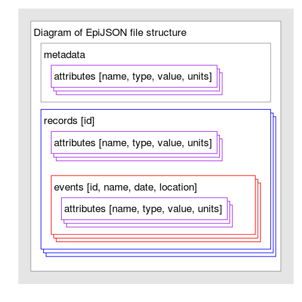
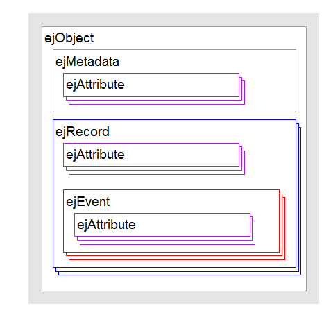

[](https://travis-ci.org/Hackout2/repijson)


*EpiJSON* is a generic JSON format for storing epidemiological data.   

*repijson* is an R package that allows conversion between EpiJSON files and R data formats.

This vignette is a demonstration of the package *repijson*.


# Installing *repijson*
-------------
To install the development version from github:

```r
library(devtools)
install_github("hackout2/repijson")
```


Then, to load the package, use:

```r
library("repijson")
```

# The *EpiJSON* format

This is a simplified representation of the *EpiJSON* format.   

 

The *repijson* objects used to store *EpiJSON* are represented in the following diagram.
 


# Validation

Demonstrating how we can go from a JSON character string or object to data frame to an obkData object

Load the required packages as necessary

```r
library(OutbreakTools)
library(sp)
library(HistData)
library(repijson)
```


These are example data in data.frame format

#Example: data frame 1

```r
data(Snow.deaths)
```
Adding some dates, pumps, some genders 

```r
simulated <- Snow.deaths
simulated$gender <- c("male","female")[(runif(nrow(simulated))>0.5) +1]
simulated$date <- as.POSIXct("1854-04-05") + rnorm(nrow(simulated), 10) * 86400
simulated$pump <- ceiling(runif(nrow(simulated)) * 5)

exampledata1<-head(simulated)
exampledata1
```

```
##   case         x         y gender                date pump
## 1    1 13.588010 11.095600 female 1854-04-13 21:25:37    5
## 2    2  9.878124 12.559180 female 1854-04-15 13:16:33    4
## 3    3 14.653980 10.180440 female 1854-04-15 07:59:27    4
## 4    4 15.220570  9.993003 female 1854-04-14 21:01:54    3
## 5    5 13.162650 12.963190   male 1854-04-15 15:09:05    2
## 6    6 13.806170  8.889046 female 1854-04-11 10:45:39    2
```

#Example: data.frame 2

```r
exampledata2<- data.frame(id=c("A","B","3D","4d"),
                 name=c("tom","andy","ellie","Ana"),
                 dob=c("1984-03-14","1985-11-13","1987-06-16","1987-06-16"),
                 gender=c("male","male","female","female"),
                 rec1contact=c(2,1,5,1),
                 rec1date=c("2014-12-28","2014-12-29","2015-01-03","2015-01-08"),
                 rec1risk=c("high","high","low","high"),  
                 rec1temp=c(39,41,41,39),
                 rec2contact=c(4,1,1,1),
                 rec2date=c("2015-01-02","2015-01-12","2015-01-09","2015-01-09"),
                 rec2risk=c("high","low","high","low"),stringsAsFactors=FALSE)
exampledata2
```

```
##   id  name        dob gender rec1contact   rec1date rec1risk rec1temp
## 1  A   tom 1984-03-14   male           2 2014-12-28     high       39
## 2  B  andy 1985-11-13   male           1 2014-12-29     high       41
## 3 3D ellie 1987-06-16 female           5 2015-01-03      low       41
## 4 4d   Ana 1987-06-16 female           1 2015-01-08     high       39
##   rec2contact   rec2date rec2risk
## 1           4 2015-01-02     high
## 2           1 2015-01-12      low
## 3           1 2015-01-09     high
## 4           1 2015-01-09      low
```

################################################
## Transition 1: data.frame to EpiJSON format ##
################################################

Use the *repijson* package to convert a data.frame object into a EpiJSON object within R:

```r
eg1 <- as.ejObject(exampledata1,	
    recordAttributes = "gender",	
    eventDefinitions = list(define_ejEvent(date="date",	name=NA, location=list(x="x", y="y", proj4string=""), attributes="pump")),
 		metadata=list())		       
eg1
```

```
## Warning in is.na(event$location): is.na() applied to non-(list or vector)
## of type 'S4'
```

```
## Warning in is.na(event$location): is.na() applied to non-(list or vector)
## of type 'S4'
```

```
## Warning in is.na(event$location): is.na() applied to non-(list or vector)
## of type 'S4'
```

```
## Warning in is.na(event$location): is.na() applied to non-(list or vector)
## of type 'S4'
```

```
## Warning in is.na(event$location): is.na() applied to non-(list or vector)
## of type 'S4'
```

```
## Warning in is.na(event$location): is.na() applied to non-(list or vector)
## of type 'S4'
```

```
## {
##     "metadata": [
## 
##     ],
##     "records": [
##         {
##             "id": 1,
##             "attributes": [
##                 {
##                     "name": "gender",
##                     "type": "character"
##                 }
##             ],
##             "events": [
##                 {
##                     "name": null,
##                     "date": "1854-04-13T21:25:37Z",
##                     "location": {
##                         "type": "FeatureCollection",
##                         "features": [
##                             {
##                                 "type": "Feature",
##                                 "id": 1,
##                                 "properties": {
##                                     "dat": 1
##                                 },
##                                 "geometry": {
##                                     "type": "Point",
##                                     "coordinates": [
##                                         13.588,
##                                         11.0956
##                                     ]
##                                 }
##                             }
##                         ]
##                     },
##                     "attributes": [
##                         {
##                             "name": "pump",
##                             "type": "double"
##                         }
##                     ]
##                 }
##             ]
##         },
##         {
##             "id": 2,
##             "attributes": [
##                 {
##                     "name": "gender",
##                     "type": "character"
##                 }
##             ],
##             "events": [
##                 {
##                     "name": null,
##                     "date": "1854-04-15T13:16:33Z",
##                     "location": {
##                         "type": "FeatureCollection",
##                         "features": [
##                             {
##                                 "type": "Feature",
##                                 "id": 1,
##                                 "properties": {
##                                     "dat": 1
##                                 },
##                                 "geometry": {
##                                     "type": "Point",
##                                     "coordinates": [
##                                         9.8781,
##                                         12.5592
##                                     ]
##                                 }
##                             }
##                         ]
##                     },
##                     "attributes": [
##                         {
##                             "name": "pump",
##                             "type": "double"
##                         }
##                     ]
##                 }
##             ]
##         },
##         {
##             "id": 3,
##             "attributes": [
##                 {
##                     "name": "gender",
##                     "type": "character"
##                 }
##             ],
##             "events": [
##                 {
##                     "name": null,
##                     "date": "1854-04-15T07:59:27Z",
##                     "location": {
##                         "type": "FeatureCollection",
##                         "features": [
##                             {
##                                 "type": "Feature",
##                                 "id": 1,
##                                 "properties": {
##                                     "dat": 1
##                                 },
##                                 "geometry": {
##                                     "type": "Point",
##                                     "coordinates": [
##                                         14.654,
##                                         10.1804
##                                     ]
##                                 }
##                             }
##                         ]
##                     },
##                     "attributes": [
##                         {
##                             "name": "pump",
##                             "type": "double"
##                         }
##                     ]
##                 }
##             ]
##         },
##         {
##             "id": 4,
##             "attributes": [
##                 {
##                     "name": "gender",
##                     "type": "character"
##                 }
##             ],
##             "events": [
##                 {
##                     "name": null,
##                     "date": "1854-04-14T21:01:54Z",
##                     "location": {
##                         "type": "FeatureCollection",
##                         "features": [
##                             {
##                                 "type": "Feature",
##                                 "id": 1,
##                                 "properties": {
##                                     "dat": 1
##                                 },
##                                 "geometry": {
##                                     "type": "Point",
##                                     "coordinates": [
##                                         15.2206,
##                                         9.993
##                                     ]
##                                 }
##                             }
##                         ]
##                     },
##                     "attributes": [
##                         {
##                             "name": "pump",
##                             "type": "double"
##                         }
##                     ]
##                 }
##             ]
##         },
##         {
##             "id": 5,
##             "attributes": [
##                 {
##                     "name": "gender",
##                     "type": "character"
##                 }
##             ],
##             "events": [
##                 {
##                     "name": null,
##                     "date": "1854-04-15T15:09:05Z",
##                     "location": {
##                         "type": "FeatureCollection",
##                         "features": [
##                             {
##                                 "type": "Feature",
##                                 "id": 1,
##                                 "properties": {
##                                     "dat": 1
##                                 },
##                                 "geometry": {
##                                     "type": "Point",
##                                     "coordinates": [
##                                         13.1626,
##                                         12.9632
##                                     ]
##                                 }
##                             }
##                         ]
##                     },
##                     "attributes": [
##                         {
##                             "name": "pump",
##                             "type": "double"
##                         }
##                     ]
##                 }
##             ]
##         },
##         {
##             "id": 6,
##             "attributes": [
##                 {
##                     "name": "gender",
##                     "type": "character"
##                 }
##             ],
##             "events": [
##                 {
##                     "name": null,
##                     "date": "1854-04-11T10:45:39Z",
##                     "location": {
##                         "type": "FeatureCollection",
##                         "features": [
##                             {
##                                 "type": "Feature",
##                                 "id": 1,
##                                 "properties": {
##                                     "dat": 1
##                                 },
##                                 "geometry": {
##                                     "type": "Point",
##                                     "coordinates": [
##                                         13.8062,
##                                         8.889
##                                     ]
##                                 }
##                             }
##                         ]
##                     },
##                     "attributes": [
##                         {
##                             "name": "pump",
##                             "type": "double"
##                         }
##                     ]
##                 }
##             ]
##         }
##     ]
## }
## 
```

Convert this into a JSON character string
using: eg1a<-r2epiJSON(eg1)


Convert this to a EpiJSON object in R
using: epiJSON2r(eg1a)

```r
eg2 <- as.ejObject(exampledata2, recordAttributes = c("name","dob","gender"),
     eventDefinitions = list(define_ejEvent(name="rec1contact",date="rec1date", attributes=list("rec1risk","rec1temp")),
                             define_ejEvent(name="rec2contact",date="rec2date", attributes="rec2risk")),
 		metadata=list())
eg2
```

```
## {
##     "metadata": [
## 
##     ],
##     "records": [
##         {
##             "id": 1,
##             "attributes": [
##                 {
##                     "name": "name",
##                     "type": "character"
##                 },
##                 {
##                     "name": "dob",
##                     "type": "character"
##                 },
##                 {
##                     "name": "gender",
##                     "type": "character"
##                 }
##             ],
##             "events": [
##                 {
##                     "name": 2,
##                     "date": "2014-12-28T00:00:00Z",
##                     "attributes": [
##                         {
##                             "name": "rec1risk",
##                             "type": "character"
##                         },
##                         {
##                             "name": "rec1temp",
##                             "type": "double"
##                         }
##                     ]
##                 },
##                 {
##                     "name": 4,
##                     "date": "2015-01-02T00:00:00Z",
##                     "attributes": [
##                         {
##                             "name": "rec2risk",
##                             "type": "character"
##                         }
##                     ]
##                 }
##             ]
##         },
##         {
##             "id": 2,
##             "attributes": [
##                 {
##                     "name": "name",
##                     "type": "character"
##                 },
##                 {
##                     "name": "dob",
##                     "type": "character"
##                 },
##                 {
##                     "name": "gender",
##                     "type": "character"
##                 }
##             ],
##             "events": [
##                 {
##                     "name": 1,
##                     "date": "2014-12-29T00:00:00Z",
##                     "attributes": [
##                         {
##                             "name": "rec1risk",
##                             "type": "character"
##                         },
##                         {
##                             "name": "rec1temp",
##                             "type": "double"
##                         }
##                     ]
##                 },
##                 {
##                     "name": 1,
##                     "date": "2015-01-12T00:00:00Z",
##                     "attributes": [
##                         {
##                             "name": "rec2risk",
##                             "type": "character"
##                         }
##                     ]
##                 }
##             ]
##         },
##         {
##             "id": 3,
##             "attributes": [
##                 {
##                     "name": "name",
##                     "type": "character"
##                 },
##                 {
##                     "name": "dob",
##                     "type": "character"
##                 },
##                 {
##                     "name": "gender",
##                     "type": "character"
##                 }
##             ],
##             "events": [
##                 {
##                     "name": 5,
##                     "date": "2015-01-03T00:00:00Z",
##                     "attributes": [
##                         {
##                             "name": "rec1risk",
##                             "type": "character"
##                         },
##                         {
##                             "name": "rec1temp",
##                             "type": "double"
##                         }
##                     ]
##                 },
##                 {
##                     "name": 1,
##                     "date": "2015-01-09T00:00:00Z",
##                     "attributes": [
##                         {
##                             "name": "rec2risk",
##                             "type": "character"
##                         }
##                     ]
##                 }
##             ]
##         },
##         {
##             "id": 4,
##             "attributes": [
##                 {
##                     "name": "name",
##                     "type": "character"
##                 },
##                 {
##                     "name": "dob",
##                     "type": "character"
##                 },
##                 {
##                     "name": "gender",
##                     "type": "character"
##                 }
##             ],
##             "events": [
##                 {
##                     "name": 1,
##                     "date": "2015-01-08T00:00:00Z",
##                     "attributes": [
##                         {
##                             "name": "rec1risk",
##                             "type": "character"
##                         },
##                         {
##                             "name": "rec1temp",
##                             "type": "double"
##                         }
##                     ]
##                 },
##                 {
##                     "name": 1,
##                     "date": "2015-01-09T00:00:00Z",
##                     "attributes": [
##                         {
##                             "name": "rec2risk",
##                             "type": "character"
##                         }
##                     ]
##                 }
##             ]
##         }
##     ]
## }
## 
```

Convert this into a JSON character string
using: eg2a<-r2epiJSON(eg2)


Convert this to a EpiJSON object in R
using: epiJSON2r(eg2a)

#######################################################
## Transition 2: EpiJSON object to data.frame format ##
#######################################################

Use the *repijson* package to convert a JSON object into a data.frame object:

```r
as.data.frame(eg1)
```

```
##   id gender               date         x         y  CRS  pump
## 1  1 female 1854-04-13 21:25:37 13.588010 11.095600 <NA>    2
## 2  2 female 1854-04-15 13:16:33  9.878124 12.559180 <NA>    5
## 3  3 female 1854-04-15 07:59:27 14.653980 10.180440 <NA>    5
## 4  4 female 1854-04-14 21:01:54 15.220570  9.993003 <NA>    5
## 5  5 female 1854-04-15 15:09:05 13.162650 12.963190 <NA>    5
## 6  6 female 1854-04-11 10:45:39 13.806170  8.889046 <NA>    5
```

#######################################################
## Transition 3: From obkData to an EpiJSON object   ##
#######################################################

These are example data in obkData format

```r
data(ToyOutbreak) 
```

Use the *repijson* package to convert an obkData object to JSON object into :

```r
eg3 <- as.ejObject(ToyOutbreak)
```

#######################################################
## Transition 4: From an EpiJSON object to obkData   ##
#######################################################

*Next function to produce*


#######################################################
## Transition 5: From an EpiJSON object to spatial   ##
#######################################################

Use the *repijson* package to convert from an EpiJSON object to spatial (sp)

```r
example1 <- as.ejObject(simulated, recordAttributes = c("gender"),
     eventDefinitions = list(define_ejEvent(date="date", name=NA, location=list(x="x", y="y", proj4string=""), attributes="pump")),
 		metadata=list())

#this is causing failure with
#Error in as.data.frame.default(X[[1L]], ...) : 
#  cannot coerce class ""ejAttribute"" to a data.frame
#sp_eg1 <- as.SpatialPointsDataFrame.ejObject(example1)

#plot(sp_eg1,pch=20,col="green")
#text(10,17,"Example from Snow Deaths data")
```

*The story continues...!!!*

