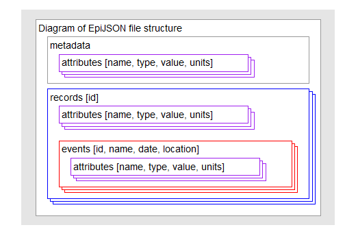
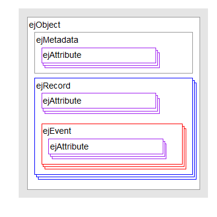

*EpiJSON* is a generic JSON format for storing epidemiological data.   

*repijson* is an R package that allows conversion between EpiJSON files and R data formats.

This vignette is a demonstration of the package *repijson*.

Epidemiological data is often stored and transferred as spread-sheets, databases, and text files with little standardisation in row, column and field names. A universal format enabling the coherent storage and transfer of these data is lacking. In many cases where transfer does occur, there is room for misinterpretation and preventable errors may be introduced into reports and analyses.

*EpiJSON* provides a potential solution for the unambiguous storage and transfer of epidemiological data. *repijson* facilitates the use of EpiJSON within R. 


# Installing *repijson*
-------------
To install the development version from github:

```r
library(devtools)
install_github("hackout2/repijson")
```


Then, to load the package, use:

```r
library("repijson")
```

# The *EpiJSON* format

This is a simplified representation of the *EpiJSON* format.   

 

The *repijson* objects used to store *EpiJSON* are represented in the following diagram.
 

#First simple example creating an repijson object from a dataframe

`toyll` is a small example dataframe within the `repijson` package. It follows the structure of a disease outbreak line list, with individuals in rows and data stored in columns. This is what the first 3 rows and 8 columns look like :

```r
toyll[1:3,1:8]
```

```
##   id  name        dob gender date.of.onset date.of.admission
## 1  A   Tom 1981-01-12   male    2014-12-28              <NA>
## 2  B  Andy 1980-11-11   male    2014-12-29        2015-01-05
## 3 3D Ellie 1982-02-10 female    2015-01-03        2015-01-12
##   date.of.discharge    hospital
## 1              <NA>        <NA>
## 2              <NA>    St Marys
## 3        2015-01-17 Whittington
```

The example below creates an `ejObject` from the first 3 rows. It assigns the columns "name" and "gender" as `record attributes`. It defines two `events`, "admission" and "discharge". The "hospital" column is assigned as an `attribute` of the first event.

```r
#converting dates to date format
toyll$date.of.admission <- as.POSIXct(toyll$date.of.admission)
toyll$date.of.discharge <- as.POSIXct(toyll$date.of.discharge)
#create ejObject
ejOb <- as.ejObject(toyll[1:3,],
                  recordAttributes=c("name","gender"),
                  eventDefinitions=list(
                      define_ejEvent(name="admission", date="date.of.admission",attributes="hospital"),
                      define_ejEvent(name="discharge", date="date.of.discharge")
                  ))
#display ejObject
ejOb
```

```
## {
##     "metadata": [
## 
##     ],
##     "records": [
##         {
##             "id": 1,
##             "attributes": [
##                 {
##                     "name": "name",
##                     "type": "string",
##                     "value": "Tom"
##                 },
##                 {
##                     "name": "gender",
##                     "type": "string",
##                     "value": "male"
##                 }
##             ],
##             "events": [
## 
##             ]
##         },
##         {
##             "id": 2,
##             "attributes": [
##                 {
##                     "name": "name",
##                     "type": "string",
##                     "value": "Andy"
##                 },
##                 {
##                     "name": "gender",
##                     "type": "string",
##                     "value": "male"
##                 }
##             ],
##             "events": [
##                 {
##                     "id": 1,
##                     "name": "admission",
##                     "date": "2015-01-05T00:00:00Z",
##                     "attributes": [
##                         {
##                             "name": "hospital",
##                             "type": "string",
##                             "value": "St Marys"
##                         }
##                     ]
##                 }
##             ]
##         },
##         {
##             "id": 3,
##             "attributes": [
##                 {
##                     "name": "name",
##                     "type": "string",
##                     "value": "Ellie"
##                 },
##                 {
##                     "name": "gender",
##                     "type": "string",
##                     "value": "female"
##                 }
##             ],
##             "events": [
##                 {
##                     "id": 1,
##                     "name": "admission",
##                     "date": "2015-01-12T00:00:00Z",
##                     "attributes": [
##                         {
##                             "name": "hospital",
##                             "type": "string",
##                             "value": "Whittington"
##                         }
##                     ]
##                 },
##                 {
##                     "id": 2,
##                     "name": "discharge",
##                     "date": "2015-01-17T00:00:00Z",
##                     "attributes": [
## 
##                     ]
##                 }
##             ]
##         }
##     ]
## }
## 
```


Load the required packages for further examples.

```r
library(OutbreakTools)
library(sp)
library(HistData)
```


Creating example dataframe 1.

```r
data(Snow.deaths)
```
Adding some dates, pumps, some genders 

```r
simulated <- Snow.deaths
simulated$gender <- c("male","female")[(runif(nrow(simulated))>0.5) +1]
simulated$date <- as.POSIXct("1854-04-05") + rnorm(nrow(simulated), 10) * 86400
simulated$pump <- ceiling(runif(nrow(simulated)) * 5)

exampledata1<-head(simulated)
exampledata1
```

```
##   case         x         y gender                date pump
## 1    1 13.588010 11.095600   male 1854-04-15 10:54:43    2
## 2    2  9.878124 12.559180   male 1854-04-14 20:25:50    5
## 3    3 14.653980 10.180440   male 1854-04-16 02:20:53    5
## 4    4 15.220570  9.993003 female 1854-04-17 01:12:46    4
## 5    5 13.162650 12.963190 female 1854-04-15 02:34:48    5
## 6    6 13.806170  8.889046 female 1854-04-16 15:33:10    3
```

Creating example dataframe 2.

```r
exampledata2<- data.frame(id=c(1,2,3,4,5),
                 name=c("Tom","Andy","Ellie","Ana","Tibo"),
                 dob=c("1981-01-12","1980-11-11","1982-02-10","1981-12-09","1983-03-08"),
                 gender=c("male","male","female","female","male"),
                 date.of.onset=c("2014-12-28","2014-12-29","2015-01-03","2015-01-08","2015-01-04"),
                 date.of.admission=c(NA,"2015-01-05","2015-01-12",NA,"2015-01-14"),
                 date.of.discharge=c(NA,NA,"2015-01-17",NA,"2015-01-17"),
                 hospital=c(NA,"St Marys","Whittington",NA,"Whittington"),
                 fever=c("yes","yes","no","no","yes"),
                 sleepy=c("no","yes","yes","no","yes"),
                 contact1.id=c("B","A","5",NA,"3D"),
                 contact1.date=c("2014-12-26","2014-12-26","2014-12-28",NA,"2014-12-28"),
                 contact2.id=c("3D","3D","5",NA,"A"),
                 contact2.date=c("2014-12-25","2014-12-26","2015-01-14",NA,"2014-12-25"),
                 contact3.id=c("B",NA,NA,NA,NA),
                 contact3.date=c("2015-01-08",NA,NA,NA,NA)
                 )
            
exampledata2
```

```
##   id  name        dob gender date.of.onset date.of.admission
## 1  1   Tom 1981-01-12   male    2014-12-28              <NA>
## 2  2  Andy 1980-11-11   male    2014-12-29        2015-01-05
## 3  3 Ellie 1982-02-10 female    2015-01-03        2015-01-12
## 4  4   Ana 1981-12-09 female    2015-01-08              <NA>
## 5  5  Tibo 1983-03-08   male    2015-01-04        2015-01-14
##   date.of.discharge    hospital fever sleepy contact1.id contact1.date
## 1              <NA>        <NA>   yes     no           B    2014-12-26
## 2              <NA>    St Marys   yes    yes           A    2014-12-26
## 3        2015-01-17 Whittington    no    yes           5    2014-12-28
## 4              <NA>        <NA>    no     no        <NA>          <NA>
## 5        2015-01-17 Whittington   yes    yes          3D    2014-12-28
##   contact2.id contact2.date contact3.id contact3.date
## 1          3D    2014-12-25           B    2015-01-08
## 2          3D    2014-12-26        <NA>          <NA>
## 3           5    2015-01-14        <NA>          <NA>
## 4        <NA>          <NA>        <NA>          <NA>
## 5           A    2014-12-25        <NA>          <NA>
```

################################################
## Transition 1: data.frame to EpiJSON format ##
################################################

Use the *repijson* package to convert a data.frame object into a EpiJSON object within R:


```r
eg1 <- as.ejObject(exampledata1,	
    recordAttributes = "gender",	
    eventDefinitions = list(define_ejEvent(date="date",	name="Death", location=list(x="x", y="y", proj4string=""), attributes="pump")),
 		metadata=list())		       
eg1
```

```
## {
##     "metadata": [
## 
##     ],
##     "records": [
##         {
##             "id": 1,
##             "attributes": [
##                 {
##                     "name": "gender",
##                     "type": "string",
##                     "value": "male"
##                 }
##             ],
##             "events": [
##                 {
##                     "id": 1,
##                     "name": "Death",
##                     "date": "1854-04-15T10:54:43Z",
##                     "location": {
##                         "type": "FeatureCollection",
##                         "features": [
##                             {
##                                 "type": "Feature",
##                                 "id": 1,
##                                 "properties": {
##                                     "dat": 1
##                                 },
##                                 "geometry": {
##                                     "type": "Point",
##                                     "coordinates": [
##                                         13.588,
##                                         11.0956
##                                     ]
##                                 }
##                             }
##                         ]
##                     },
##                     "attributes": [
##                         {
##                             "name": "pump",
##                             "type": "number",
##                             "value": 2
##                         }
##                     ]
##                 }
##             ]
##         },
##         {
##             "id": 2,
##             "attributes": [
##                 {
##                     "name": "gender",
##                     "type": "string",
##                     "value": "male"
##                 }
##             ],
##             "events": [
##                 {
##                     "id": 1,
##                     "name": "Death",
##                     "date": "1854-04-14T20:25:50Z",
##                     "location": {
##                         "type": "FeatureCollection",
##                         "features": [
##                             {
##                                 "type": "Feature",
##                                 "id": 2,
##                                 "properties": {
##                                     "dat": 1
##                                 },
##                                 "geometry": {
##                                     "type": "Point",
##                                     "coordinates": [
##                                         9.8781,
##                                         12.5592
##                                     ]
##                                 }
##                             }
##                         ]
##                     },
##                     "attributes": [
##                         {
##                             "name": "pump",
##                             "type": "number",
##                             "value": 5
##                         }
##                     ]
##                 }
##             ]
##         },
##         {
##             "id": 3,
##             "attributes": [
##                 {
##                     "name": "gender",
##                     "type": "string",
##                     "value": "male"
##                 }
##             ],
##             "events": [
##                 {
##                     "id": 1,
##                     "name": "Death",
##                     "date": "1854-04-16T02:20:53Z",
##                     "location": {
##                         "type": "FeatureCollection",
##                         "features": [
##                             {
##                                 "type": "Feature",
##                                 "id": 3,
##                                 "properties": {
##                                     "dat": 1
##                                 },
##                                 "geometry": {
##                                     "type": "Point",
##                                     "coordinates": [
##                                         14.654,
##                                         10.1804
##                                     ]
##                                 }
##                             }
##                         ]
##                     },
##                     "attributes": [
##                         {
##                             "name": "pump",
##                             "type": "number",
##                             "value": 5
##                         }
##                     ]
##                 }
##             ]
##         },
##         {
##             "id": 4,
##             "attributes": [
##                 {
##                     "name": "gender",
##                     "type": "string",
##                     "value": "female"
##                 }
##             ],
##             "events": [
##                 {
##                     "id": 1,
##                     "name": "Death",
##                     "date": "1854-04-17T01:12:46Z",
##                     "location": {
##                         "type": "FeatureCollection",
##                         "features": [
##                             {
##                                 "type": "Feature",
##                                 "id": 4,
##                                 "properties": {
##                                     "dat": 1
##                                 },
##                                 "geometry": {
##                                     "type": "Point",
##                                     "coordinates": [
##                                         15.2206,
##                                         9.993
##                                     ]
##                                 }
##                             }
##                         ]
##                     },
##                     "attributes": [
##                         {
##                             "name": "pump",
##                             "type": "number",
##                             "value": 4
##                         }
##                     ]
##                 }
##             ]
##         },
##         {
##             "id": 5,
##             "attributes": [
##                 {
##                     "name": "gender",
##                     "type": "string",
##                     "value": "female"
##                 }
##             ],
##             "events": [
##                 {
##                     "id": 1,
##                     "name": "Death",
##                     "date": "1854-04-15T02:34:48Z",
##                     "location": {
##                         "type": "FeatureCollection",
##                         "features": [
##                             {
##                                 "type": "Feature",
##                                 "id": 5,
##                                 "properties": {
##                                     "dat": 1
##                                 },
##                                 "geometry": {
##                                     "type": "Point",
##                                     "coordinates": [
##                                         13.1626,
##                                         12.9632
##                                     ]
##                                 }
##                             }
##                         ]
##                     },
##                     "attributes": [
##                         {
##                             "name": "pump",
##                             "type": "number",
##                             "value": 5
##                         }
##                     ]
##                 }
##             ]
##         },
##         {
##             "id": 6,
##             "attributes": [
##                 {
##                     "name": "gender",
##                     "type": "string",
##                     "value": "female"
##                 }
##             ],
##             "events": [
##                 {
##                     "id": 1,
##                     "name": "Death",
##                     "date": "1854-04-16T15:33:10Z",
##                     "location": {
##                         "type": "FeatureCollection",
##                         "features": [
##                             {
##                                 "type": "Feature",
##                                 "id": 6,
##                                 "properties": {
##                                     "dat": 1
##                                 },
##                                 "geometry": {
##                                     "type": "Point",
##                                     "coordinates": [
##                                         13.8062,
##                                         8.889
##                                     ]
##                                 }
##                             }
##                         ]
##                     },
##                     "attributes": [
##                         {
##                             "name": "pump",
##                             "type": "number",
##                             "value": 3
##                         }
##                     ]
##                 }
##             ]
##         }
##     ]
## }
## 
```

The *repijson* package does not convert dates represented as strings for you. This is because the process 
of conversion from character to date-time is fraught with difficulty and the hidden corruption of dates is much 
worse than being told by R to provide date objects. Here we convert the dates in the example two data to real 
dates. We use POSIXct as this is more firendly to data.frames.


```r
exampledata2$date.of.onset <- as.POSIXct(exampledata2$date.of.onset)
exampledata2$date.of.admission <- as.POSIXct(exampledata2$date.of.admission)
exampledata2$date.of.discharge <- as.POSIXct(exampledata2$date.of.discharge)
exampledata2$contact1.date <- as.POSIXct(exampledata2$contact1.date)
exampledata2$contact2.date <- as.POSIXct(exampledata2$contact2.date)
exampledata2$contact3.date <- as.POSIXct(exampledata2$contact3.date)
```

We are now set to convert the exampledata2 dataframe to an EpiJSON object.

```r
eg2 <- as.ejObject(exampledata2, recordAttributes = c("id","name","dob","gender"),
     eventDefinitions = list(define_ejEvent(name="Date Of Onset", date="date.of.onset", 
                                            attributes=list()),
                             define_ejEvent(name="Hospital admission", date="date.of.admission", 
											attributes=list("hospital", "fever", "sleepy")),
							 define_ejEvent(name="Hospital discharge", date="date.of.discharge"),
							 define_ejEvent(name="Contact1", date="contact1.date", attributes=list("contact1.id")),
							 define_ejEvent(name="Contact2", date="contact2.date", attributes=list("contact2.id")),
							 define_ejEvent(name="Contact3", date="contact3.date", attributes=list("contact3.id"))
						),
 		metadata=list())
eg2
```

```
## {
##     "metadata": [
## 
##     ],
##     "records": [
##         {
##             "id": 1,
##             "attributes": [
##                 {
##                     "name": "id",
##                     "type": "number",
##                     "value": 1
##                 },
##                 {
##                     "name": "name",
##                     "type": "string",
##                     "value": "Tom"
##                 },
##                 {
##                     "name": "dob",
##                     "type": "string",
##                     "value": "1981-01-12"
##                 },
##                 {
##                     "name": "gender",
##                     "type": "string",
##                     "value": "male"
##                 }
##             ],
##             "events": [
##                 {
##                     "id": 1,
##                     "name": "Date Of Onset",
##                     "date": "2014-12-28T00:00:00Z",
##                     "attributes": [
## 
##                     ]
##                 },
##                 {
##                     "id": 4,
##                     "name": "Contact1",
##                     "date": "2014-12-26T00:00:00Z",
##                     "attributes": [
##                         {
##                             "name": "contact1.id",
##                             "type": "string",
##                             "value": "B"
##                         }
##                     ]
##                 },
##                 {
##                     "id": 5,
##                     "name": "Contact2",
##                     "date": "2014-12-25T00:00:00Z",
##                     "attributes": [
##                         {
##                             "name": "contact2.id",
##                             "type": "string",
##                             "value": "3D"
##                         }
##                     ]
##                 },
##                 {
##                     "id": 6,
##                     "name": "Contact3",
##                     "date": "2015-01-08T00:00:00Z",
##                     "attributes": [
##                         {
##                             "name": "contact3.id",
##                             "type": "string",
##                             "value": "B"
##                         }
##                     ]
##                 }
##             ]
##         },
##         {
##             "id": 2,
##             "attributes": [
##                 {
##                     "name": "id",
##                     "type": "number",
##                     "value": 2
##                 },
##                 {
##                     "name": "name",
##                     "type": "string",
##                     "value": "Andy"
##                 },
##                 {
##                     "name": "dob",
##                     "type": "string",
##                     "value": "1980-11-11"
##                 },
##                 {
##                     "name": "gender",
##                     "type": "string",
##                     "value": "male"
##                 }
##             ],
##             "events": [
##                 {
##                     "id": 1,
##                     "name": "Date Of Onset",
##                     "date": "2014-12-29T00:00:00Z",
##                     "attributes": [
## 
##                     ]
##                 },
##                 {
##                     "id": 2,
##                     "name": "Hospital admission",
##                     "date": "2015-01-05T00:00:00Z",
##                     "attributes": [
##                         {
##                             "name": "hospital",
##                             "type": "string",
##                             "value": "St Marys"
##                         },
##                         {
##                             "name": "fever",
##                             "type": "string",
##                             "value": "yes"
##                         },
##                         {
##                             "name": "sleepy",
##                             "type": "string",
##                             "value": "yes"
##                         }
##                     ]
##                 },
##                 {
##                     "id": 4,
##                     "name": "Contact1",
##                     "date": "2014-12-26T00:00:00Z",
##                     "attributes": [
##                         {
##                             "name": "contact1.id",
##                             "type": "string",
##                             "value": "A"
##                         }
##                     ]
##                 },
##                 {
##                     "id": 5,
##                     "name": "Contact2",
##                     "date": "2014-12-26T00:00:00Z",
##                     "attributes": [
##                         {
##                             "name": "contact2.id",
##                             "type": "string",
##                             "value": "3D"
##                         }
##                     ]
##                 }
##             ]
##         },
##         {
##             "id": 3,
##             "attributes": [
##                 {
##                     "name": "id",
##                     "type": "number",
##                     "value": 3
##                 },
##                 {
##                     "name": "name",
##                     "type": "string",
##                     "value": "Ellie"
##                 },
##                 {
##                     "name": "dob",
##                     "type": "string",
##                     "value": "1982-02-10"
##                 },
##                 {
##                     "name": "gender",
##                     "type": "string",
##                     "value": "female"
##                 }
##             ],
##             "events": [
##                 {
##                     "id": 1,
##                     "name": "Date Of Onset",
##                     "date": "2015-01-03T00:00:00Z",
##                     "attributes": [
## 
##                     ]
##                 },
##                 {
##                     "id": 2,
##                     "name": "Hospital admission",
##                     "date": "2015-01-12T00:00:00Z",
##                     "attributes": [
##                         {
##                             "name": "hospital",
##                             "type": "string",
##                             "value": "Whittington"
##                         },
##                         {
##                             "name": "fever",
##                             "type": "string",
##                             "value": "no"
##                         },
##                         {
##                             "name": "sleepy",
##                             "type": "string",
##                             "value": "yes"
##                         }
##                     ]
##                 },
##                 {
##                     "id": 3,
##                     "name": "Hospital discharge",
##                     "date": "2015-01-17T00:00:00Z",
##                     "attributes": [
## 
##                     ]
##                 },
##                 {
##                     "id": 4,
##                     "name": "Contact1",
##                     "date": "2014-12-28T00:00:00Z",
##                     "attributes": [
##                         {
##                             "name": "contact1.id",
##                             "type": "string",
##                             "value": "5"
##                         }
##                     ]
##                 },
##                 {
##                     "id": 5,
##                     "name": "Contact2",
##                     "date": "2015-01-14T00:00:00Z",
##                     "attributes": [
##                         {
##                             "name": "contact2.id",
##                             "type": "string",
##                             "value": "5"
##                         }
##                     ]
##                 }
##             ]
##         },
##         {
##             "id": 4,
##             "attributes": [
##                 {
##                     "name": "id",
##                     "type": "number",
##                     "value": 4
##                 },
##                 {
##                     "name": "name",
##                     "type": "string",
##                     "value": "Ana"
##                 },
##                 {
##                     "name": "dob",
##                     "type": "string",
##                     "value": "1981-12-09"
##                 },
##                 {
##                     "name": "gender",
##                     "type": "string",
##                     "value": "female"
##                 }
##             ],
##             "events": [
##                 {
##                     "id": 1,
##                     "name": "Date Of Onset",
##                     "date": "2015-01-08T00:00:00Z",
##                     "attributes": [
## 
##                     ]
##                 }
##             ]
##         },
##         {
##             "id": 5,
##             "attributes": [
##                 {
##                     "name": "id",
##                     "type": "number",
##                     "value": 5
##                 },
##                 {
##                     "name": "name",
##                     "type": "string",
##                     "value": "Tibo"
##                 },
##                 {
##                     "name": "dob",
##                     "type": "string",
##                     "value": "1983-03-08"
##                 },
##                 {
##                     "name": "gender",
##                     "type": "string",
##                     "value": "male"
##                 }
##             ],
##             "events": [
##                 {
##                     "id": 1,
##                     "name": "Date Of Onset",
##                     "date": "2015-01-04T00:00:00Z",
##                     "attributes": [
## 
##                     ]
##                 },
##                 {
##                     "id": 2,
##                     "name": "Hospital admission",
##                     "date": "2015-01-14T00:00:00Z",
##                     "attributes": [
##                         {
##                             "name": "hospital",
##                             "type": "string",
##                             "value": "Whittington"
##                         },
##                         {
##                             "name": "fever",
##                             "type": "string",
##                             "value": "yes"
##                         },
##                         {
##                             "name": "sleepy",
##                             "type": "string",
##                             "value": "yes"
##                         }
##                     ]
##                 },
##                 {
##                     "id": 3,
##                     "name": "Hospital discharge",
##                     "date": "2015-01-17T00:00:00Z",
##                     "attributes": [
## 
##                     ]
##                 },
##                 {
##                     "id": 4,
##                     "name": "Contact1",
##                     "date": "2014-12-28T00:00:00Z",
##                     "attributes": [
##                         {
##                             "name": "contact1.id",
##                             "type": "string",
##                             "value": "3D"
##                         }
##                     ]
##                 },
##                 {
##                     "id": 5,
##                     "name": "Contact2",
##                     "date": "2014-12-25T00:00:00Z",
##                     "attributes": [
##                         {
##                             "name": "contact2.id",
##                             "type": "string",
##                             "value": "A"
##                         }
##                     ]
##                 }
##             ]
##         }
##     ]
## }
## 
```


#######################################################
## Transition 2: EpiJSON object to data.frame format ##
#######################################################

Use the *repijson* package to convert a JSON object into a data.frame object:

```r
as.data.frame(eg1)
```

```
##   id gender          Death_date Death_locationX Death_locationY
## 1  1   male 1854-04-15 10:54:43       13.588010       11.095600
## 2  2   male 1854-04-14 20:25:50        9.878124       12.559180
## 3  3   male 1854-04-16 02:20:53       14.653980       10.180440
## 4  4 female 1854-04-17 01:12:46       15.220570        9.993003
## 5  5 female 1854-04-15 02:34:48       13.162650       12.963190
## 6  6 female 1854-04-16 15:33:10       13.806170        8.889046
##   Death_locationCRS pump
## 1              <NA>    2
## 2              <NA>    5
## 3              <NA>    5
## 4              <NA>    4
## 5              <NA>    5
## 6              <NA>    3
```

```r
as.data.frame(eg2)
```

```
##   id id.1  name        dob gender Date.Of.Onset_date Contact1_date
## 1  1    1   Tom 1981-01-12   male         2014-12-28    2014-12-26
## 2  2    2  Andy 1980-11-11   male         2014-12-29    2014-12-26
## 3  3    3 Ellie 1982-02-10 female         2015-01-03    2014-12-28
## 4  4    4   Ana 1981-12-09 female         2015-01-08          <NA>
## 5  5    5  Tibo 1983-03-08   male         2015-01-04    2014-12-28
##   contact1.id Contact2_date contact2.id Contact3_date contact3.id
## 1           B    2014-12-25          3D    2015-01-08           B
## 2           A    2014-12-26          3D          <NA>        <NA>
## 3           5    2015-01-14           5          <NA>        <NA>
## 4        <NA>          <NA>        <NA>          <NA>        <NA>
## 5          3D    2014-12-25           A          <NA>        <NA>
##   Hospital.admission_date    hospital fever sleepy Hospital.discharge_date
## 1                    <NA>        <NA>  <NA>   <NA>                    <NA>
## 2              2015-01-05    St Marys   yes    yes                    <NA>
## 3              2015-01-12 Whittington    no    yes              2015-01-17
## 4                    <NA>        <NA>  <NA>   <NA>                    <NA>
## 5              2015-01-14 Whittington   yes    yes              2015-01-17
```

#######################################################
## Transition 3: From obkData to an EpiJSON object   ##
#######################################################

These are example data in obkData format

```r
data(ToyOutbreak) 
```

Use the *repijson* package to convert an obkData object to JSON object into :

```r
eg3 <- as.ejObject(ToyOutbreak)
```

#######################################################
## Transition 4: From an EpiJSON object to obkData   ##
#######################################################

*Next function to produce*


#######################################################
## Transition 5: From an EpiJSON object to spatial   ##
#######################################################

Use the *repijson* package to convert from an EpiJSON object to spatial (sp). 
Here we get the location of all the events as a SpatialPointsDataFrame

```r
sp_eg1 <- as.SpatialPointsDataFrame.ejObject(eg1)
plot(sp_eg1,pch=20,col="green")
text(10,17,"Example from Snow Deaths data")
```

 
